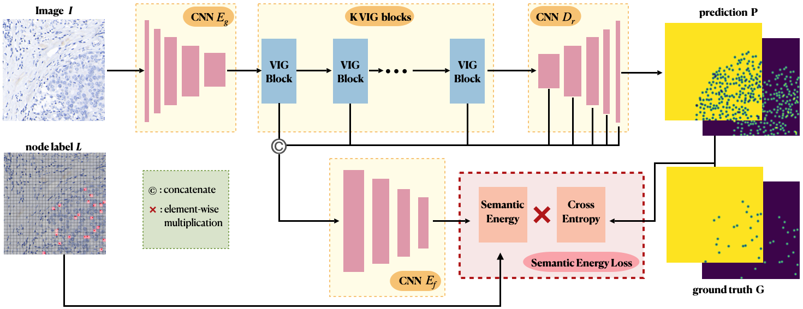
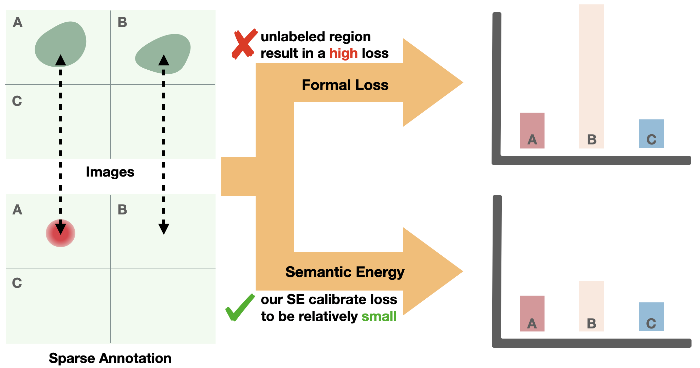

# Addressing Sparse Annotation: a Novel Semantic Energy Loss for Tumor Cell Detection from Histopathologic Images

This repository contains the pytorch code for the paper:

Addressing Sparse Annotation: a Novel Semantic Energy Loss for Tumor Cell Detection from Histopathologic Images, BIBM2023. ([PDF](https://ieeexplore.ieee.org/document/10385899))


We have released the source code of the loss function ‘semantic_energy_loss.py’, and the rest of the content will be released soon. 
We look forward to your attention.

## Citation

If you find this code useful in your research, please cite our work:

```
@article{Xu2023AddressingSA,
  title={Addressing Sparse Annotation: a Novel Semantic Energy Loss for Tumor Cell Detection from Histopathologic Images},
  author={Zhengyang Xu and XiangLong Du and Yuxin Kang and Hong Lv and Ming Li and Wentao Yang and Lei Cui and Hansheng Li and Yaqiong Xing and Jun Feng and Lin Yang},
  journal={2023 IEEE International Conference on Bioinformatics and Biomedicine (BIBM)},
  year={2023},
  pages={1588-1595},
  url={https://api.semanticscholar.org/CorpusID:267045003}
}
```

## Introduction
Tumor cell detection plays a vital role in immunohistochemistry (IHC) quantitative analysis. While recent remarkable developments in fullysupervised deep learning have greatly contributed to the efficiency of this task, the necessity for manually annotating all cells of specific detection types remains impractical. Obviously, if we directly use full supervision to train these datasets, it can cause error in loss calculation due to the misclassification of unannotated cells as background. To address this issue, we observe that although some cells are omitted during the annotation process, these unannotated cells have a significant feature similarity with the annotated ones. Leveraging this characteristic, we propose a novel calibrated loss named Semantic Energy Loss (SEL). Specifically, our SEL automatically adjusts the loss to be lower for unannotated regions with similar semantic to the labeled ones, while penalizing regions with lager semantic difference. Besides, to prevent all regions from having similar semantics during training, we propose Stretched Feature Loss (SFL) that widen the semantic distance. We evaluate our method on two different IHC datasets and achieve significant performance improvements in both sparse and exhaustive annotation scenarios. Furthermore, we also validate that our method holds significant potential for detecting multiple types of cells. 






## Dependecies
In the environment configuration, we primarily utilize `torch==1.7.1`.
For further details, please refer to `requirements.txt`.

## Usage

### Data preparation
<!-- Before training, you need to prepare the training images and ground truth. 
For the ground truth, each labeled point carries both position and the staining state of the cell membrane information. 
The position information refers to the coordinate of centroid of cells, while the staining state of the cell membrane include complete membrane, incomplete membrane and no membrane.

As an example from our dataset, we visualize the ground truth using colored-coordinates.
In this visualization, red represents complete membrane, blue represents incomplete membrane, and green represents no membrane. -->


<!-- | Image | ground truth |
| -----|-----| 
|  |  |  -->


### Model training and test
<!-- To training a model, set related parameters in the file `options.py` and run `python train.py`

To evaluate the trained model on the test set, set related parameters in the file `options.py` and run `python test.py`.  -->
